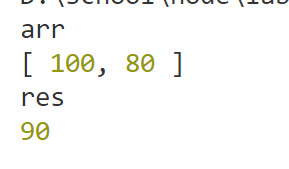

# 2021-2022学年第2学期

# **实 验 报 告**


- 课程名称:跨平台脚本开发技术
- 实验项目: 函数式编程，管道式程序设计
- 专业班级__计算机1903_
- 学生学号__31901077_
- 学生姓名__缪奇鹏_
- 实验指导教师:郭鸣

## 实验内容


JavaScript函数式编程指南（异步图书）.pdf

阅读 第3 章 第 4 章


假设需要用程序计算那些选了多门课程的学生的平均成绩。已知选课数据的数组：

命令式实现 

```js
let enrollment = [
  {enrolled: 2, grade: 100},
  {enrolled: 2, grade: 80},
  {enrolled: 1, grade: 89}
];

var totalGrades = 0;
var totalStudentsFound = 0;
for(let i = 0; i < enrollment.length; i++) {
    let student = enrollment [i];
    if(student !== null) {
       if(student.enrolled > 1) {
          totalGrades+= student.grade;
          totalStudentsFound++;
       }
    }
}
var average = totalGrades / totalStudentsFound; //-> 90
```

 lodash 对象函数链

```js
_.chain(enrollment)
  .filter(student => student.enrolled > 1)
  .pluck('grade')
  .average()
  .value(); //-> 90  <---调用 _.value() 会触发整个链上的所有操作

```
用 ramda 实现上面的命令式代码，注意理解 函数管道pipeline的思想

cnpm i -S rambda

```js
let R = require(''rambda'')
...
)

import { pipe, map, filter, length, add, multiply,prop ,
    // ,average,value
    sum
} from 'rambda'
// rambda average


let enrollment = [
    {enrolled: 2, grade: 100},
    {enrolled: 2, grade: 80},
    {enrolled: 1, grade: 89}
  ];

let count = 0;
const list = [1, 2, 3, 4]


// 只有顺序一种控制,用高阶函数去掉命令式程序中的 循环，分支
// 函数式 pipeline 操作管道
let count_fp = pipe(
    map((x) => x + 2),
    filter((x) => x > 3),
    length
)

let average=(arr)=>{
    console.log("arr");
    console.log(arr);
    let sum=0;
    for(let  i=0;i<arr.length;i++){
        sum+=arr[i];
    }
    return sum/arr.length
    // alert(sum/arr.length);
}


let avgScore = pipe(
    filter(student => student.enrolled > 1),
    // R.propEq('grade', 2),
    // R.prop('grade'),
    map(prop('grade')) ,
    // average(),
    average,
    // sum
    // map((x) => x + 2),
    // value()
    // sum()
    // length
)

let res= avgScore(enrollment)
console.log("res");
console.log(res);


```



### 大作业 中采用 函数式程序设计思想
